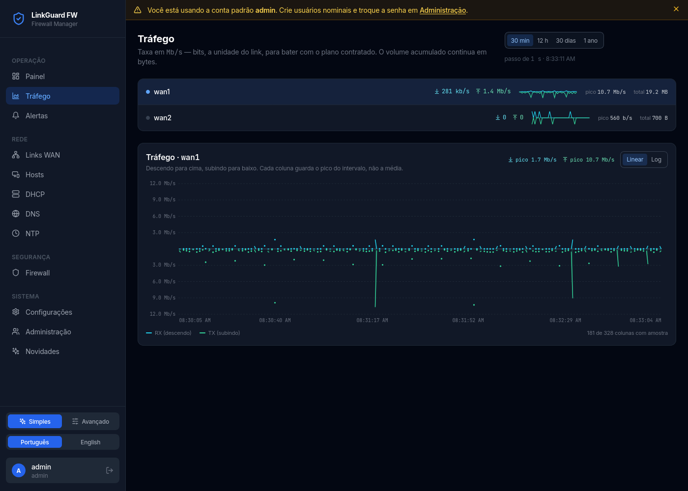
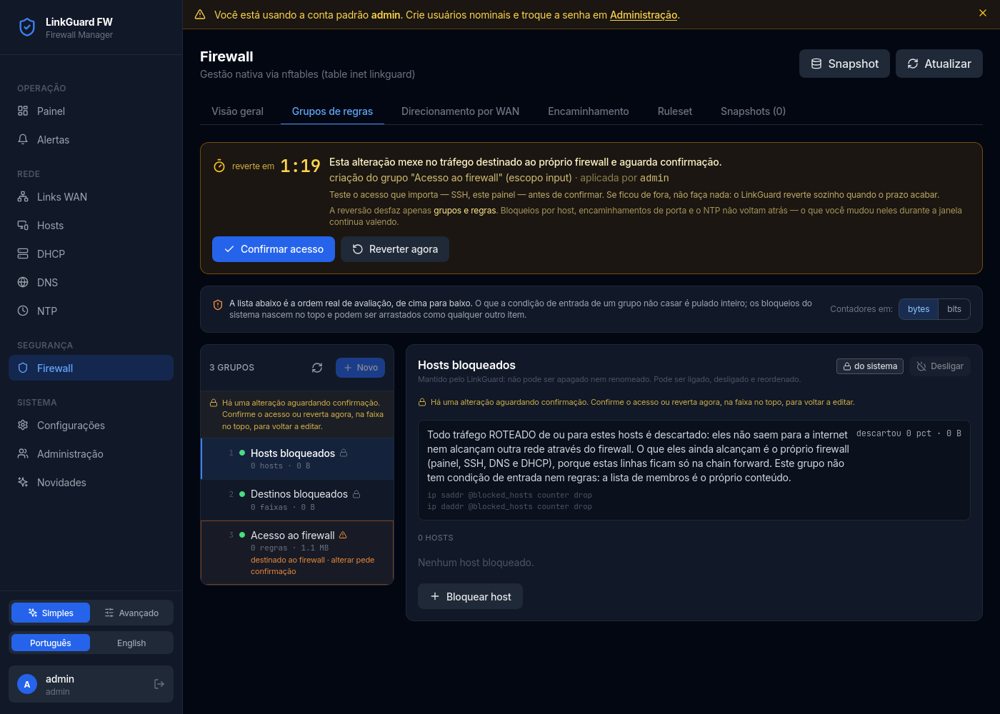
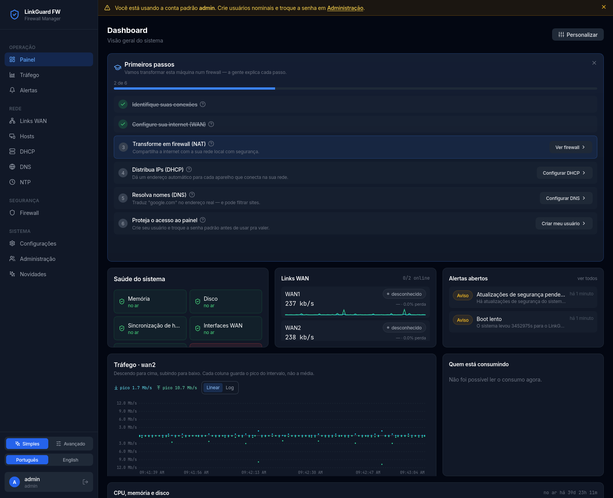
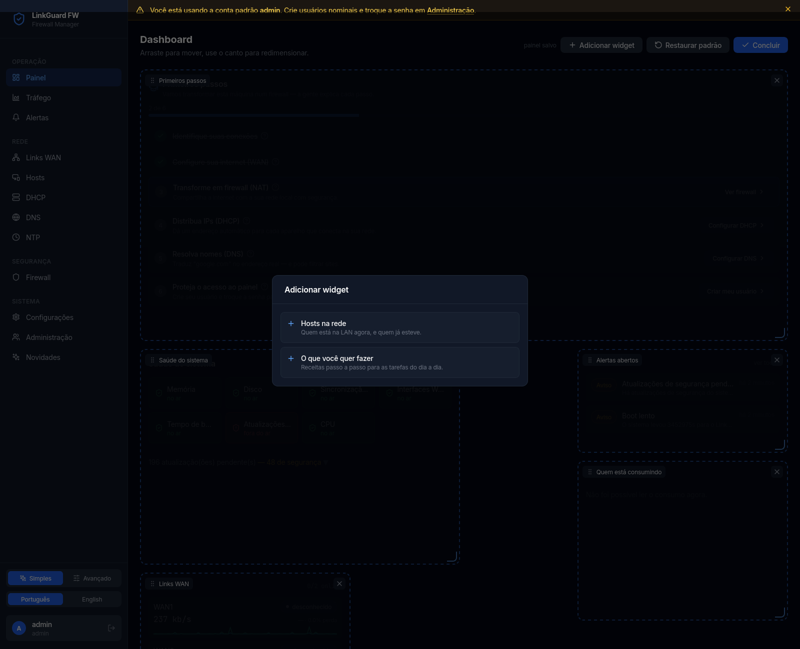

# LinkGuard FW

**Turns a bare Debian box into a managed firewall appliance — and then owns it.**

LinkGuard FW manages the whole edge of a small network from one web panel:
native **nftables** firewalling, multi-WAN load balancing and failover, policy
routing, DHCP (Kea), recursive DNS (unbound), NTP (chrony), interface naming,
LAN host inventory and per-host bandwidth. You install LinkGuard on a machine
with nothing on it; it installs and configures the rest itself.

It is written for the person who currently keeps a firewall alive by hand — a
pile of `iptables` lines in `rc.local`, an `/etc/network/interfaces` nobody
dares touch, and a DHCP config that only one person understands.



## Status

Honest version: **it runs one production firewall**, a two-WAN edge box for a
small company, and has since July 2026. It is not a widely deployed product and
has no user base to speak of. What it does have is an unusually paranoid
delivery process — see [Safety architecture](#safety-architecture) and
[the project history](docs/TRAJETORIA.md).

- ~31.5k lines of Go, ~35.2k lines of Go **tests** (there is more test code
  than production code), plus a React/TypeScript panel.
- Every release is validated on a throwaway VM, from a bare install, before it
  touches the production machine.
- MIT licensed. Panel is bilingual (Portuguese / English).

**Do not** adopt it as a drop-in replacement for a firewall you depend on
without reading the next section first. It is an appliance: it takes the
machine over.

## ⚠️ Read before installing: LinkGuard takes over the machine

**LinkGuard is an appliance, not a helper tool.** Once installed, it takes
ownership of the host's networking stack — hardware, addressing, firewall and
the network services it manages. It **enforces its own configuration on every
startup**, which means manual edits to the files below are overwritten
without warning. That is the intended behaviour: the whole point is that the
panel is the source of truth, not a pile of hand-edited files.

Do not install it on a machine that is also doing something else you care
about, and do not expect hand-made changes to these to survive:

| What it takes over | Where |
|---|---|
| Firewall ruleset | its own `table inet linkguard` in nftables, persisted to `/etc/nftables.conf` |
| IP forwarding & conntrack accounting | `/proc/sys/net/ipv4/ip_forward`, `/etc/sysctl.d/99-linkguard-*.conf` |
| Routing between WANs | the default route (multipath/failover), `ip rule` policy routing |
| DNS resolver (unbound) | `/etc/unbound/unbound.conf.d/linkguard.conf` |
| The host's own resolver | `/etc/resolv.conf` → `127.0.0.1`, plus a `supersede` line in `/etc/dhcp/dhclient.conf` so DHCP renewals stop reverting it |
| DHCP server (Kea) | `/etc/kea/kea-dhcp4.conf` (owned entirely), and `/etc/kea` permissions |
| Time sync (chrony) | `/etc/chrony/conf.d/linkguard.conf`; enables the service, and can install it on request |
| Network interface naming | `.link` files under `/etc/systemd/network` (pins names to MAC addresses) |
| Its own config & secrets | `/etc/linkguard-fw/` |
| Its own base packages | installs `nftables`, `iproute2`, `iptables` and `iputils-ping` itself on the first boot if they are missing (see "Installing on a bare machine") |

It never edits the packages' own primary config files (`chrony.conf`,
`unbound.conf`): it writes drop-ins alongside them, so a package upgrade
never fights LinkGuard. `/etc/nftables.conf` is the exception — LinkGuard
owns that file, and as of v1.0.94 writes only its own table into it.

What it deliberately does **not** touch: `/etc/network/interfaces` (ifupdown
is still hand-managed on current installs) and anything unrelated to
networking.

## Delivery rule (non-negotiable)

> **Nothing here is a mock-up. Everything implemented must actually work on
> the system, and must be manageable from the web panel — enable, disable,
> edit and verify — without SSH.**

A feature counts as delivered only when all three hold: it applies real
system state (config files, nftables rules, service reloads) rather than just
persisting to the database; it is fully controllable from the panel under the
matching RBAC permission; and the panel lets the admin verify it is genuinely
in effect (configured is not the same as working — a watcher that only reads
a config file proves nothing).

Backend without a screen is not a delivery. A screen without real effect is
worse than nothing: it creates false confidence, which is precisely what this
tool exists to eliminate. See `FEATURES.md` for the full statement.

## Safety architecture

A firewall panel can lock its own operator out of a remote machine, at night,
with no physical access. Most of the design decisions below exist because of
that single sentence.

**The database is the truth; nftables is the rendered result.** LinkGuard owns
`table inet linkguard` and rebuilds it from the database on every boot. It
never flushes the whole ruleset and never touches another program's table — so
Docker, libvirt or your own hand-written tables survive everything LinkGuard
does, including a snapshot rollback.

**Every mutation is dry-run first.** The exact script that would be applied is
fed to `nft -c -f` *before* anything is written to the database. A rule the
kernel would reject never reaches persistent state.

**Confirm-or-revert on anything that can lock you out.** Rules scoped to
traffic *destined for the firewall itself* (SSH, the panel, DNS) open a
90-second window: you apply, you test that you still have access, and you
confirm. If you do not confirm — because you just cut your own SSH — LinkGuard
reverts by itself. The pending state lives in the database, so a reboot or a
power cut inside the window reverts too, instead of making an unconfirmed
lockout permanent.



**The `input` chain is always `policy accept`.** Blocking is done with explicit
rules, never with a restrictive default policy — a `policy drop` would lock the
operator out at the instant it was applied. A snapshot that tries to restore a
restrictive input policy is refused.

**"Configured" is never shown as "working".** The panel compares what the
database says against what the kernel actually has, and labels the difference.
Where a value cannot be measured it shows `—`, never a synthetic zero: a dead
link must not look like an idle one.

**Watchers must be able to be wrong out loud.** A false critical alert is worse
than no alert — it teaches the operator to ignore the screen. Several fixes in
this project's history are about removing alerts that were technically true and
practically noise.

## Screenshots

| | |
|---|---|
|  |  |
| Dashboard on a fresh install — the guided setup disappears on its own once the six steps are done | Each admin builds their own dashboard; the catalog only offers what their RBAC role can see |

## Features

### Firewall

- **Native nftables** — LinkGuard owns `table inet linkguard`; it does not
  shell out to `iptables` for its own rules
- **Rule groups** — chains presented as ordered groups with an entry condition
  ("only traffic from this network reaches these rules"), drag-to-reorder, and
  a per-group on/off that removes it from the firewall without deleting it
- **Two scopes** — rules for traffic *crossing* the firewall (`forward`) or
  *destined for it* (`input`); the second is what the confirm-or-revert window
  protects
- **Connection-aware blocking** — a group can apply to *new connections only*
  (`ct state new`), so you stop a host from opening anything new without
  killing the transfer it already has in flight
- **Host and destination blocking**, port forwarding, and per-WAN steering
- **Snapshots and rollback** — scoped to LinkGuard's own table; other programs'
  tables are never touched

### Network

- **Multi-WAN** — load balancing and automatic failover, with configurable
  thresholds, cooldown, and active eviction of flows pinned to a degraded link
- **Policy routing** — per-host WAN steering
- **Interfaces** — physical, VLAN and bridge management; names pinned to MAC
  addresses, because PCI-based names are not stable across a disk swap
- **DHCP (Kea)** and **recursive DNS (unbound)** — fully owned config, applied
  by graceful reload, with a DNS query log
- **NTP (chrony)** — client and LAN server, with a hardened `input` chain

### Visibility

- **Traffic** — 1-second sampling per interface into a built-in time series
  database, at 1s/60s/900s/3600s resolutions; mirrored chart where each pixel
  keeps the **peak** of its interval, not the average, because bursts are what
  kill links
- **LAN host inventory** and per-host bandwidth (top talkers)
- **Customizable dashboard** — 12-column grid, drag and resize, layout saved
  per user, catalog filtered by RBAC permission
- **Watchers** — system health, disk SMART, slow boot, journal corruption, NTP
  drift, and boot-config drift
- **Prometheus metrics** at `/metrics`, plus alerts and a full audit trail

### Operation

- **Multi-admin RBAC** — nominal users with per-resource permissions
- **Dry-run mode** — every command previewable before it touches the system
- **Encrypted scheduled backups**
- **Self-update** from GitHub releases

## Architecture

The Go binary embeds the built frontend, so a deployment is a single file plus
a SQLite database.

```
linkguard-fw/
├── cmd/linkguard-fw/      # Entry point: boot sequence, reconciliation order
├── internal/
│   │                      ── firewall ─────────────────────────────────
│   ├── nftables/           # Owns `table inet linkguard`: render, reconcile,
│   │                       #   dry-run check, persist, live-state comparison
│   ├── firewallrules/      # Rules and groups; the confirm-or-revert window
│   ├── iptables/           # Legacy parser, read-only (pre-nftables era)
│   │                      ── network ──────────────────────────────────
│   ├── links/              # WAN link CRUD and health
│   ├── balancer/           # Multi-WAN balancing, degraded-link eviction
│   ├── failover/           # Failover state machine
│   ├── routes/             # ip route / ip rule
│   ├── netif/              # Interfaces: physical, VLAN, bridge, naming
│   ├── netsvc/ keaunbound/ # DHCP + DNS behind a provider abstraction
│   ├── timesync/           # chrony: client and LAN server
│   ├── hosts/ hosttraffic/ # LAN inventory and per-host bandwidth
│   ├── dnslog/             # DNS query log
│   │                      ── platform ─────────────────────────────────
│   ├── bootstrapdeps/      # Installs the base packages on first boot
│   ├── sysprep/            # System paths and packaging invariants
│   ├── storage/            # SQLite: models, repository, migrations
│   ├── tsdb/               # Time series: 1s sampling, rollups, pruning
│   ├── monitoring/         # Watchers and health checks
│   ├── alerts/ notify/     # Alerts and delivery
│   ├── auth/               # JWT, RBAC, permissions
│   ├── secrets/ backupcrypt/ # Secret vault, encrypted backups
│   ├── firewall/           # Executor interface (real + dry-run)
│   ├── api/handlers/       # REST handlers, one per resource
│   └── ai/                 # Optional BYOK advisory layer
├── web/src/
│   ├── pages/              # Dashboard, Traffic, Firewall, Links, DHCP, ...
│   ├── components/widgets/ # Dashboard widgets
│   └── lib/                # Grid geometry, time series maths (no deps)
├── deploy/                 # systemd unit, postinst, install.sh
└── docs/                   # Specs, plans and project history
```

**No frontend dependencies beyond React and Vite.** The dashboard grid
(collision resolution, upward compaction) and the traffic charts are written by
hand. On a security appliance, a layout library is supply-chain surface bought
for convenience.

## Requirements

- **OS**: Debian 13 (Trixie) or compatible — a bare install is enough, see below
- **Go**: 1.25+ (to build from source — see `go.mod`)
- **Node.js**: 18+ (for frontend build)
- **Permissions**: Root (it manages nftables, routing and system services)

## Installing on a bare machine

**You do not install the dependencies and then LinkGuard. You install
LinkGuard, and it brings what it needs.** That is the same premise as
"LinkGuard takes over the machine" above, applied to the install itself: it
goes in first, on a machine with nothing on it, and coordinates the rest.

```bash
# Recommended — works on a machine with nothing installed on it:
sudo apt install ./linkguard-fw_<version>_amd64.deb   # apt resolves everything up front

# Also works, when apt is not an option (see "Do not install nftables by hand" below):
sudo dpkg -i ./linkguard-fw_<version>_amd64.deb       # LinkGuard finishes the job itself
```

The package declares its base (`nftables`, `iproute2`, `iptables`,
`iputils-ping`) as `Recommends:`, not `Depends:`, on purpose: with `Depends:`,
a plain `dpkg -i` on a bare box stops half-way (`iU`, "dependency problems
prevent configuration"), the service never starts, and there is no panel left
to explain what went wrong. As `Recommends:` the package always installs *and*
configures, the service starts, and on its first boot it installs whatever
base package is missing itself (`internal/bootstrapdeps`) — a running service
can call apt, a package's own maintainer scripts cannot (dpkg holds its lock
for the whole run).

### Do not install `nftables` by hand afterwards

**Use `sudo apt install ./linkguard-fw_<version>_amd64.deb` and let LinkGuard
bring `nftables` in on its own.** That path is clean end to end: it finishes
with no questions asked, and there is nothing to do afterwards.

The path that trips people up is starting the service and *then* installing
`nftables` yourself. By the time you do, LinkGuard has already created
`/etc/nftables.conf` — it owns that file, it is listed in the table above, and
it is written before the service comes up. The `nftables` package then finds a
config file it did not write and asks what to do with it:

```
Configuration file '/etc/nftables.conf'
 ==> File on system created by you or by a script.
*** nftables.conf (Y/I/N/O/D/Z) [default=N] ?
```

- **At a terminal**, answer **N** — keep the version currently on the system.
  That is LinkGuard's file, and it is the one the firewall boots from.
- **From a script, Ansible or a pipeline** there is nobody to answer, so the
  install stops with **exit code 100** and leaves `nftables` half-configured.
  Nothing is broken and the machine is fine — the automation just looks like
  it failed.

**If that already happened, restart the service and it resolves itself:**

```bash
sudo systemctl restart linkguard-fw
```

LinkGuard notices the half-configured package on startup and finishes the
installation with the right options, keeping its own `/etc/nftables.conf`.
Confirm with `systemctl is-active linkguard-fw` and the firewall screen in the
panel.

The optional packages are **not** installed at boot — that would take over
services nobody asked for. What actually installs what, and when:

| Package | Installed by | Trigger |
|---|---|---|
| `kea-dhcp4-server`, `unbound`, `dns-root-data` | LinkGuard | saving or applying the DHCP/DNS settings — install **and** apply happen in the same action, with no service restart |
| `chrony` | LinkGuard | the explicit "install chrony" button on the NTP screen (never automatically) |
| `smartmontools` | apt, via `Recommends:` | `apt install ./linkguard-fw_*.deb`. LinkGuard does **not** install it; where it is absent, the disk-health check reports "no data" rather than inventing any |

That "no service restart" is why `linkguard-fw --prepare-system` (run by
every installation path: the .deb's postinst, `deploy/install.sh` and
`make install`) creates `/etc/kea`, `/etc/unbound/unbound.conf.d` and
`/etc/chrony/conf.d` empty: the unit runs under `ProtectSystem=strict`, and
systemd builds its mount namespace when the service *starts* — a directory
apt creates later would be read-only to the running process.

**If it cannot install them** (no network, unreachable mirror, broken
repository), it does not pretend: it retries once after refreshing the apt
index, then raises a **critical alert on the Alerts screen** naming each
missing package and what stops working because of it ("without nftables there
is no packet filter at all: nothing is blocked, NAT is not applied and no rule
from the panel has any effect"), together with the command to install it by
hand. The same goes to the journal, and the service keeps running — so there
is a panel to read the alert on. **No restart is needed**: LinkGuard retries
on its own every few minutes (30s, 2min, 5min, then every 15min), so a box
that simply had no WAN yet at boot heals itself; and if you install the
packages by hand over SSH, the next attempt notices and closes the alert.
That is what the alert body says too — the two used to disagree, and this
one was the wrong one.

## Quick Start

### Build from source

```bash
# 1. Build frontend and backend
make build

# 2. Run in dry-run mode (safe, no system changes)
./dist/linkguard-fw --dry-run --debug --addr 127.0.0.1 --port 9997

# 3. Open the web UI
# http://127.0.0.1:9997
# Login: admin / admin   <-- change immediately!
```

### Install as systemd service

```bash
# 1. Build the binary
make build

# 2. Run the install script as root
sudo bash deploy/install.sh

# 3. (optional) Adjust the config — jwt_secret is already a strong random
#    value generated by install.sh; only edit it if you specifically need to
#    replace it. Other settings (listen_addr, etc.) are safe to change.
sudo nano /etc/linkguard-fw/config.json

# 4. Enable and start the service
sudo systemctl enable --now linkguard-fw

# 5. Check status
sudo systemctl status linkguard-fw
sudo journalctl -u linkguard-fw -f
```

### Using Make

```
make build          - Build frontend + backend
make build-frontend - Build only the React frontend
make build-backend  - Build only the Go binary
make test           - Run all Go tests
make test-coverage  - Run tests with HTML coverage report
make run            - Build and run in dry-run mode
make install        - Install binary and service (requires root)
make uninstall      - Remove binary and service
make clean          - Remove build artifacts
make clean-all      - Remove build artifacts and node_modules
make help           - Show all available targets
```

## Configuration

Default config file: `/etc/linkguard-fw/config.json`

```json
{
  "listen_addr": "127.0.0.1",
  "port": 9997,
  "db_path": "/var/lib/linkguard-fw/linkguard.db",
  "jwt_secret": "<64-char random value, auto-generated by install.sh — must be at least 32 chars or the service refuses to start>",
  "dry_run": false,
  "debug": false,
  "monitor_interval_seconds": 30,
  "failover_enabled": true,
  "failover_threshold": 3,
  "recovery_threshold": 2,
  "failover_cooldown_seconds": 60,
  "metrics_enabled": true
}
```

CLI flags override config file values:

```
--config   path to config file
--dry-run  enable dry-run mode (no system changes)
--debug    enable debug logging
--addr     listen address (default: 127.0.0.1)
--port     listen port (default: 9997)
```

## API Endpoints

```
GET  /api/health                  - Health check (no auth)
GET  /api/system/status           - System metrics
POST /api/auth/login              - Login, returns JWT token
POST /api/auth/change-password    - Change password

GET  /api/links                   - List WAN links
POST /api/links                   - Create WAN link
GET  /api/links/{id}              - Get WAN link
PUT  /api/links/{id}              - Update WAN link
DELETE /api/links/{id}            - Delete WAN link

GET  /api/routes                  - List routing table
GET  /api/routes/rules            - List ip rules
GET  /api/routes/all              - List all routing tables

GET  /api/iptables/rules          - List all iptables tables
GET  /api/iptables/{table}        - List specific table (filter, nat, mangle)
GET  /api/firewall/backups        - List firewall snapshots
POST /api/firewall/preview        - Preview command
POST /api/firewall/rules          - Legacy iptables rule (WAN-balance wizard only)

GET  /api/nftables/overview       - Live firewall overview (table inet linkguard)
GET  /api/nftables/ruleset        - Full live ruleset
GET  /api/nftables/backups        - List firewall snapshots
POST /api/nftables/backup         - Take a firewall snapshot
POST /api/nftables/rollback       - Restore a snapshot (scoped to inet linkguard)

GET  /api/alerts                  - List alerts
PUT  /api/alerts/{id}/resolve     - Resolve an alert

GET  /api/failover/events         - List failover events

GET  /api/logs                    - List audit logs

GET  /metrics                     - Prometheus metrics (no auth)
```

## Prometheus Metrics

Exposed at `/metrics`:

| Metric | Description |
|--------|-------------|
| `linkguard_link_status` | WAN link status (1=online, 0=offline) |
| `linkguard_link_latency_ms` | Average latency per link |
| `linkguard_link_packet_loss_percent` | Packet loss per link |
| `linkguard_interface_rx_bytes_total` | Bytes received per interface |
| `linkguard_interface_tx_bytes_total` | Bytes transmitted per interface |
| `linkguard_failover_events_total` | Total failover events |
| `linkguard_alerts_unresolved_total` | Current unresolved alerts |
| `linkguard_cpu_usage_percent` | System CPU usage |
| `linkguard_memory_usage_percent` | System memory usage |
| `linkguard_disk_usage_percent` | System disk usage |

### Grafana / external Prometheus

If you already run Prometheus on the box (or reachable from it), point it at
LinkGuard with the job in `deploy/prometheus/linkguard.yml` — copy its
contents into your `scrape_configs`. A starter Grafana dashboard is at
`deploy/grafana/linkguard-dashboard.json` (Dashboards → Import → paste the
file contents).

This is entirely optional — LinkGuard keeps its own history (see the
Monitoring page's timeline) and does not require Prometheus to function.

**Known pitfall:** if you migrated from bind9 to unbound (see the DHCP/DNS
docs), remove any leftover `job_name: bind` entry in your `prometheus.yml` —
it will show as a permanently-down target for a service that no longer runs.

## Security

- The web UI is bound to `127.0.0.1` by default — not exposed to the internet
- All API endpoints (except `/api/health` and `/api/auth/login`) require a valid JWT token
- Default admin password is `admin` — **change it immediately after first login**
- All firewall commands are validated before execution; inputs are never concatenated into shell strings
- Every configuration change is logged in the audit log
- Dry-run mode previews commands without applying them
- Automatic snapshot of the ruleset before any `apply`, with one-click rollback.
  The restore is **scoped to `table inet linkguard`** — other programs' tables
  (Docker, libvirt, your own) are never flushed, and a snapshot carrying a
  restrictive `input` policy is refused rather than applied

### Firewall evaluation order changed: blocks now win

**As of this release, blocked hosts and blocked destinations ("Bloqueios e
direcionamento" tab) are evaluated BEFORE the admin's own rule groups, and
always win.** Before, it was the other way around — an `accept` in a rule
group could override a block. If you are updating an existing production
install: anything you had relying on a rule group letting through a host or
destination that is also on a blocklist will now be blocked instead. Review
your blocklists and rule groups after updating.

## Development

```bash
# Backend (hot-recompile with go run)
go run ./cmd/linkguard-fw/ --dry-run --debug

# Frontend (Vite dev server with HMR)
cd web && npm run dev

# Run tests
make test

# Run tests with race detector
go test -race ./...
```

## License

MIT
