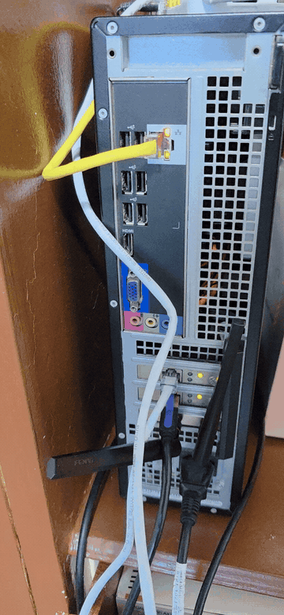
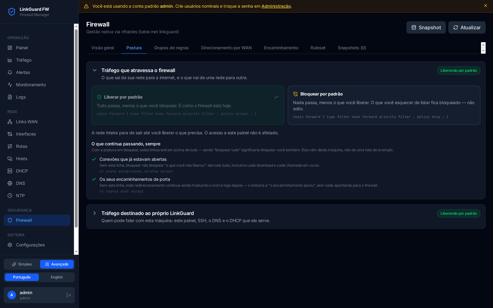

# LinkGuard FW

## Project Motivation

**🇧🇷 Português**

Este projeto nasce de uma necessidade real, que acredito que nao seja somente minha, de ter redudancia de link usando uma maquina desktop comum.
Trabalho home office a mais de 10 anos e sempre dependi da estabilidade dos provedores de Internet nao cairem. Quando caiam recorria a rede 3G/4G/5G. 
Após morar com minha esposa e ambos trabalharem remoto dependi ainda mais de links de Internet e ja passei problemas com elas e contratei mais 1 link.

Como resolver para que os links trabalhassem em failover ou em paralelo?
Trabalhei muito tempo com linux e provedores de internet sem uso de appliance e tive a oportunidade de trabalhar e gerenciar firewalls com multiplas interfaces usando iptables com chains (FILTER,NAT,MANGLE), iproute2, isc-dhcp-server, bind9 como soluçoes. Sempre funcionaram muito bem porem dependiam de muitos scripts para funcionar e nao era garantia de funcionar 100%.

Com o uso de IA me permitiu desenvolver em tempo record uma soluçao madura dentro de caso com meu super firewall: um Intel Core i3-3220 de 2012 (2 nucleos / 4 threads a 3.30 GHz), 4 GB de RAM e um HD magnetico de 250 GB a 7200 RPM. Era uma maquina usada de um escritorio e ja passa dos 13 anos de idade. Adicionei 2 placas de rede e dei inicou ao desenvolvimento.

Logo nasce o linkguard, soluçao robusta para redundancia e balanceamento de link e monitoramento proativo.

**🇺🇸 English**

This project was born from a real need, one I believe is not only mine, to have link redundancy using a common desktop machine.
I've worked home office for over 10 years and always depended on Internet providers' stability not going down. When they did, I fell back to the 3G/4G/5G network.
After moving in with my wife, with both of us working remotely, I depended even more on Internet links, and we already had problems with them, so I contracted one more link.

How to solve it so the links would work in failover or in parallel?
I worked for a long time with Linux and Internet providers without using an appliance, and had the opportunity to work with and manage firewalls with multiple interfaces using iptables with chains (FILTER, NAT, MANGLE), iproute2, isc-dhcp-server, bind9 as solutions. They always worked very well, but depended on a lot of scripts to function, and there was no guarantee they would work 100%.

Using AI allowed me to develop a mature solution in record time, as a real case on my super firewall: a 2012 Intel Core i3-3220 (2 cores / 4 threads at 3.30 GHz), 4 GB of RAM and a 250 GB (magnetic) 7200 RPM hard disk. It was a used office machine, and it is already past 13 years old. I added 2 network cards and started development.

Thus LinkGuard was born, a robust solution for link redundancy and balancing, with proactive monitoring.

## Em produção hoje / Running in production today

**🇧🇷** A mesma máquina segue de pé, rodando 24/7 como firewall de borda da
casa. O disco magnético original deu lugar a um SSD, mas o resto do hardware é
o de sempre — a ideia é justamente essa: hardware de 2012 dá conta.

**🇺🇸** The same machine is still standing, running 24/7 as the home's edge
firewall. The original magnetic disk gave way to an SSD, but the rest of the
hardware is the same as always — that is exactly the point: 2012 hardware is
enough.

<table>
<tr>
<td valign="top">

| | |
|---|---|
| CPU | Intel Core i3-3220 @ 3.30 GHz — 2 cores / 4 threads (Ivy Bridge, 2012) |
| RAM | 4 GB |
| Disco / Disk | SSD 512 GB (boot) + HD 250 GB 7200 RPM (o original / the original) |
| Rede / Network | 2 links WAN + LAN, todas gigabit / all gigabit |
| SO / OS | Debian 13 (Trixie), kernel 6.12 |
| LinkGuard | 1.0.102 |

**🇧🇷** Sem rack, sem nobreak, sem sala refrigerada: um desktop de escritório
aposentado, de pé num canto, com duas placas de rede a mais. Os LEDs piscando
são os dois links de Internet passando tráfego de verdade.

**🇺🇸** No rack, no UPS, no cooled room: a retired office desktop standing in a
corner with two extra network cards. The blinking LEDs are the two Internet
links actually passing traffic.

</td>
<td width="360" valign="top">



</td>
</tr>
</table>

## Telas / Screenshots

**🇧🇷** Painel, tráfego, a postura padrão do firewall e a janela de confirmação
que evita você se trancar para fora. **🇺🇸** Dashboard, traffic, the firewall's
default posture, and the confirmation window that keeps you from locking
yourself out.

| Painel / Dashboard | Tráfego / Traffic |
|---|---|
|  |  |

| Confirmar ou reverter / Confirm or revert | Widgets do painel / Dashboard widgets |
|---|---|
|  |  |

**🇧🇷** Bloquear por padrão e liberar só o que você autorizar — com a lista do
que continua passando lida da própria máquina, não de um exemplo.
**🇺🇸** Default-deny with an explicit allowlist — and the "what still gets
through" list read from this very machine, not from an example.

| Postura padrão do firewall / Firewall default posture |
|---|
|  |

## Futuro do Projeto

**🇧🇷 Português**

Futuramente nascera mais features porem saindo do mundo mais residencial/empresarial de pequeno porte e vamos para a Cloud.
- Substituir o cego NatGateways que existem nas Clouds hoje e traferemos rastreabilidade real e monitoramento de segurança proativo de entrada e saida de dados.
- Soluçao de VPN robusta autenticada e gerenciada via SSO + grupos e perfil.

**🇺🇸 English**

In the future, more features will be born, moving beyond the more residential/small-business world and going into the Cloud.
- Replace the blind NatGateways that exist in Clouds today, and we will bring real traceability and proactive security monitoring of data entering and leaving.
- Robust VPN solution, authenticated and managed via SSO + groups and profile.

## Convite

**🇧🇷 Português**

Para entusiastas que tambem queiram se aventurar e ajudar na evoluçao do projeto sera muito bem vindo. Pessoas e empresas que compartilham desta dor poderam fazer parte desta jornada em resolver de fato essas dores reais.

**🇺🇸 English**

For enthusiasts who also want to venture in and help the evolution of the project, it will be very welcome. People and companies that share this pain will be able to be part of this journey to actually solve these real pains.

**🇧🇷 Transforma uma máquina Debian nua em um appliance de firewall gerenciado — e então passa a ser dono dela.**

**🇺🇸 Turns a bare Debian box into a managed firewall appliance — and then owns it.**

LinkGuard FW manages the whole edge of a small network from one web panel:
native **nftables** firewalling, multi-WAN load balancing and failover, policy
routing, DHCP (Kea), recursive DNS (unbound), NTP (chrony), interface naming,
LAN host inventory and per-host bandwidth. You install LinkGuard on a machine
with nothing on it; it installs and configures the rest itself.

It is written for the person who currently keeps a firewall alive by hand — a
pile of `iptables` lines in `rc.local`, an `/etc/network/interfaces` nobody
dares touch, and a DHCP config that only one person understands.

## Installation

**🇧🇷 Português**

**Requisitos:** Debian 13 (Trixie) ou compatível, acesso root. Uma instalação
limpa (sem nada instalado) já é suficiente — você não precisa instalar
nenhuma dependência antes.

```bash
# Instala o pacote — o apt resolve e instala as dependências base
# (nftables, iproute2, iptables, iputils-ping) automaticamente
sudo apt install ./linkguard-fw_<version>_amd64.deb

# Habilita e inicia o serviço
sudo systemctl enable --now linkguard-fw

# Verifica o status
sudo systemctl status linkguard-fw
```

Depois abra o painel web em `http://<ip-da-maquina>:9997`.

- **Usuário:** `admin`
- **Senha:** gerada no primeiro início — leia no log do serviço
  (`sudo journalctl -u linkguard-fw`) ou em
  `/etc/linkguard-fw/initial-admin-password` (modo `0600`). Troque-a
  imediatamente após o primeiro login.

**🇺🇸 English**

**Requirements:** Debian 13 (Trixie) or compatible, root access. A bare
install is enough — you do not need to install any dependencies first.

```bash
# Install the package — apt resolves and installs its base dependencies
# (nftables, iproute2, iptables, iputils-ping) automatically
sudo apt install ./linkguard-fw_<version>_amd64.deb

# Enable and start the service
sudo systemctl enable --now linkguard-fw

# Check status
sudo systemctl status linkguard-fw
```

Then open the web panel at `http://<machine-ip>:9997`.

- **User:** `admin`
- **Password:** generated on first run — read it from the service log
  (`sudo journalctl -u linkguard-fw`) or from
  `/etc/linkguard-fw/initial-admin-password` (mode `0600`). Change it
  immediately after first login.

## License

MIT
